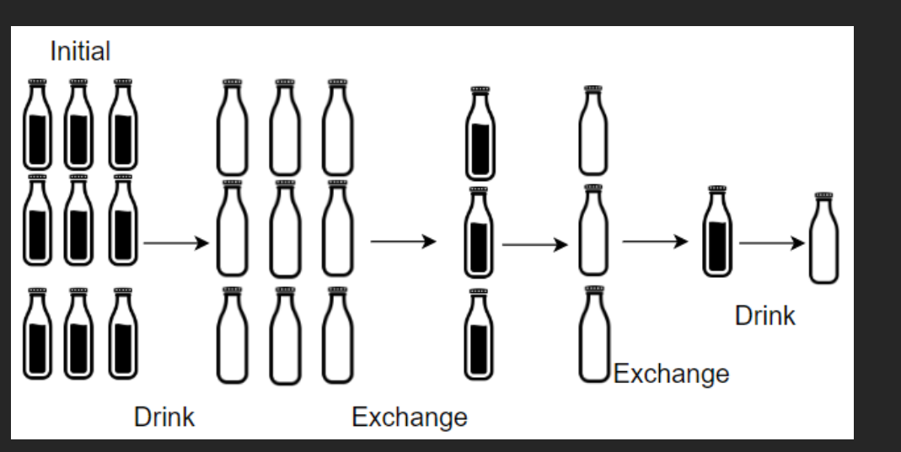
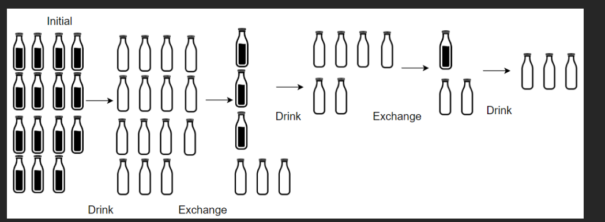

### 🍼 LeetCode 1518 — Water Bottles

This repository contains the solution to LeetCode Problem 1518 — Water Bottles implemented in C++.

## 📘 Problem Summary

You start with:

numBottles → full water bottles

numExchange → empty bottles needed to get 1 full bottle

Every time you drink, the bottle becomes empty.
You can keep exchanging empty bottles for new full ones.

## 🔍 Example

# Example 1

Input: numBottles = 9, numExchange = 3
Output: 13
Explanation: 9 + 3 + 1 = 13

# Example 2

Input: numBottles = 15, numExchange = 4
Output: 19
Explanation: 15 + 3 + 1 = 19

## 💡 Approach

We simulate the process:

Drink all full bottles

Collect empty bottles

Exchange as long as possible

Add exchanged full bottles to result

Continue until exchanges are not possible

## 🧾 C++ Code

```cpp
class Solution {
public:
    int numWaterBottles(int numBottles, int numExchange) {
        int ans = numBottles;

        while (numBottles / numExchange > 0) {
            int lr = (numBottles / numExchange);
            int leftb = (numBottles % numExchange) + lr;
            ans += lr;
            numBottles = leftb;
        }

        return ans;
    }
};
```
## 🧠 Complexity

Time Complexity: O(n)

Space Complexity: O(1)