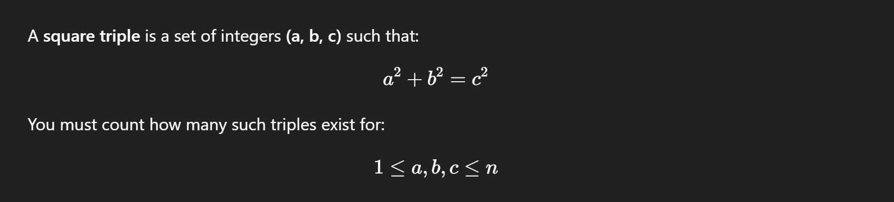

## 🔢 LeetCode 1925 — Count Square Sum Triples

This repository contains the solution to LeetCode Problem 1925 — Count Square Sum Triples implemented in C++.



# 📘 Problem Summary

Given an integer n, count all valid triples (a, b, c) that satisfy:

All values are ≤ n

They form a Pythagorean triple

Order matters → (a, b, c) and (b, a, c) are counted separately
Example: (3,4,5) and (4,3,5)

# 🧮 Examples

Example 1
Input: n = 5
Output: 2
Explanation:
(3,4,5) and (4,3,5)

Example 2
Input: n = 10
Output: 4
Explanation:
(3,4,5), (4,3,5), (6,8,10), (8,6,10)

# 💡 Approach

We try all values of:

a from 1 to n

b from a+1 to n

Compute c = sqrt(a² + b²)

A valid triple occurs when:

c is a whole number (perfect square)

c ≤ n

Since (a, b) and (b, a) both count → we add 2 each time

This brute-force method works efficiently because:

n ≤ 250


# 🧾 C++ Implementation
```cpp
class Solution {
public:
    int countTriples(int n) {
        int ans = 0;

        for (int i = 2; i < n - 1; i++) {
            double c;

            for (int j = i + 1; j < n; j++) {
                int z = (i * i) + (j * j);
                c = sqrt(z);

                if (c == int(c) && c <= n)
                    ans += 2; // (a,b,c) and (b,a,c)
            }
        }
        return ans;
    }
};
```
# ⏱️ Complexity

Time Complexity: O(n²)

Space Complexity: O(1)